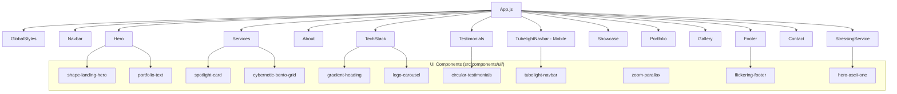

# Porto Tamas — Developer Portfolio


> Personal portfolio website for **Tama EL Pablo** — Backend Developer specializing in Laravel, PHP, APIs, and security-first DevOps solutions.

**Live**: [porto.tams.codes](https://porto.tams.codes)

---

## Features

- **10 Custom UI Components** — Shape Landing Hero, Animated Text, Spotlight Cards, Cybernetic Bento Grid, Gradient Heading, Logo Carousel, Circular Testimonials, Tubelight Navbar, Zoom Parallax, Flickering Footer
- **Dark/Light Theme** — Violet/purple palette with CSS custom properties
- **Accessibility** — Skip-to-content link, ARIA labels, landmark roles, `prefers-reduced-motion` support
- **Performance** — React.lazy code-splitting, passive scroll listeners, IntersectionObserver, memoized components
- **SEO** — Open Graph & Twitter Card meta tags, semantic HTML
- **TypeScript** — Enabled with gradual adoption (`.tsx` for new components, `.jsx` for motion-heavy files)
- **CI/CD** — GitHub Actions for lint/test/build pipeline, deploy workflow, auto-release

## Architecture



## Project Structure

```
src/
├── __mocks__/           # Jest mocks for ESM packages
├── __tests__/           # Test suites
│   ├── App.test.js      # App smoke tests
│   ├── Sections.test.js # Section render tests
│   └── UIComponents.test.js # UI component tests
├── components/
│   ├── common/          # Shared components (Button, Card, etc.)
│   ├── sections/        # Page sections (Hero, About, Services, etc.)
│   └── ui/              # UI primitives (shadcn-like)
├── hooks/               # Custom hooks (useReducedMotion, usePageVisibility)
├── lib/                 # Utilities (cn helper)
├── App.js               # Main app shell
├── index.js             # Entry point
└── index.css            # Tailwind directives
```

## Tech Stack

| Category | Technology |
|----------|-----------|
| Framework | React 18.2 + Create React App |
| Styling | Tailwind CSS 3.4 + CSS Variables |
| Animation | Framer Motion 10 |
| Icons | Lucide React, React Icons |
| Type Safety | TypeScript 5.9 (gradual) |
| Testing | Jest + React Testing Library |
| CI/CD | GitHub Actions |

## Getting Started

```bash
# Clone
git clone https://github.com/el-pablos/portome.git
cd portome

# Install
npm ci --legacy-peer-deps

# Dev server
npm start

# Build
npm run build

# Test
npm test

# Lint
npm run lint
```

## Scripts

| Script | Description |
|--------|-------------|
| `npm start` | Development server on port 3000 |
| `npm run build` | Production build to `build/` |
| `npm test` | Run tests in watch mode |
| `npm run lint` | ESLint check with zero warnings |

## CI/CD

- **CI Pipeline** (`ci.yml`) — Runs lint → test → build on push/PR to main across Node 18/20/22
- **Deploy** (`deploy.yml`) — Builds and deploys to server via SCP on push to main
- **Release** (`release.yml`) — Auto-generates changelog and creates GitHub Release on version tags

## Environment Variables (Deploy)

Set these as GitHub repository secrets:

| Secret | Description |
|--------|-------------|
| `DEPLOY_HOST` | Server hostname/IP |
| `DEPLOY_USER` | SSH username |
| `DEPLOY_KEY` | SSH private key |
| `DEPLOY_PATH` | Target directory path |

## Color Theme

The violet/purple palette is defined via CSS custom properties:

| Variable | Light | Dark |
|----------|-------|------|
| `--violet-primary` | `#7c3aed` | `#a78bfa` |
| `--violet-secondary` | `#8b5cf6` | `#c4b5fd` |
| `--bg-primary` | `#ffffff` | `#0b0414` |
| `--bg-card` | `rgba(255,255,255,0.8)` | `rgba(255,255,255,0.05)` |

## Interactive Features

- **Typewriter Title** — Animated browser tab title with blinking cursor
- **Dynamic Favicon** — Rotating coding symbols (`</>`, `{}`, `()`)
- **URL Hash Animation** — Cycles through themed hash values
- **Visitor Counter** — Session-based tracking with localStorage
- **GitHub Statistics** — Live stats from @el-pablos and @dasaraul accounts

## Contact

- **GitHub**: [@el-pablos](https://github.com/el-pablos) | [@dasaraul](https://github.com/dasaraul)
- **Telegram**: [@ImTamaa](https://t.me/ImTamaa)
- **Location**: Jakarta Selatan, Indonesia

## License

MIT © Tama EL Pablo