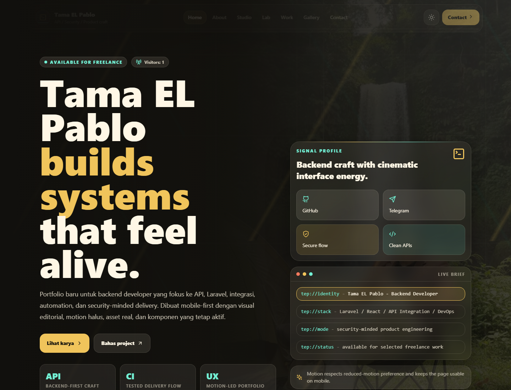
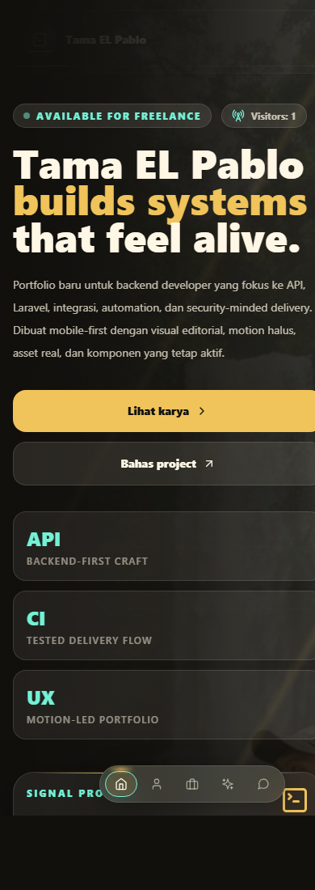
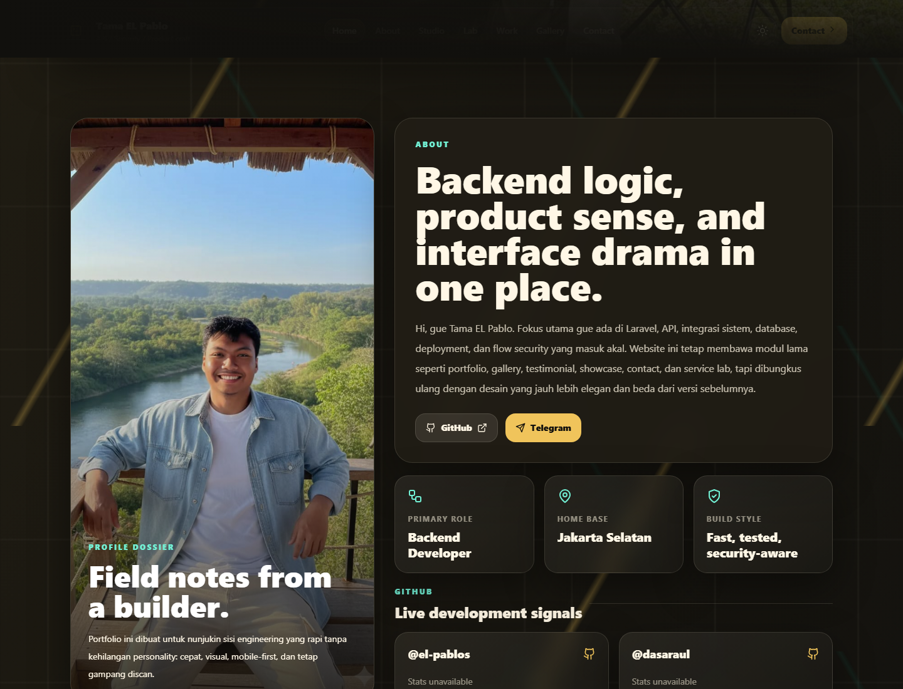
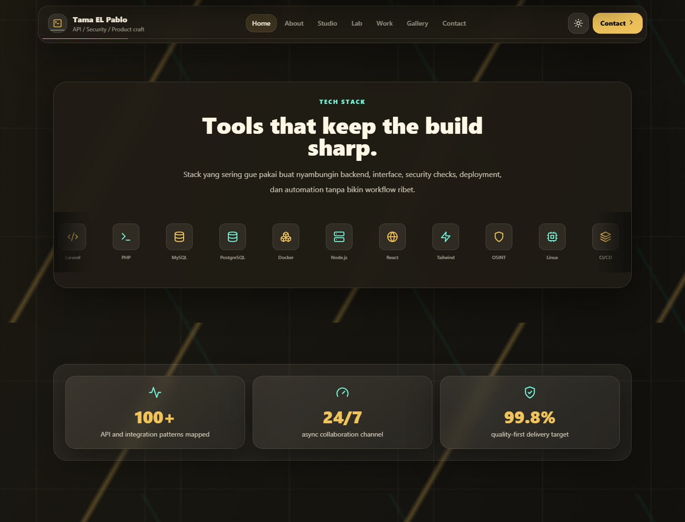
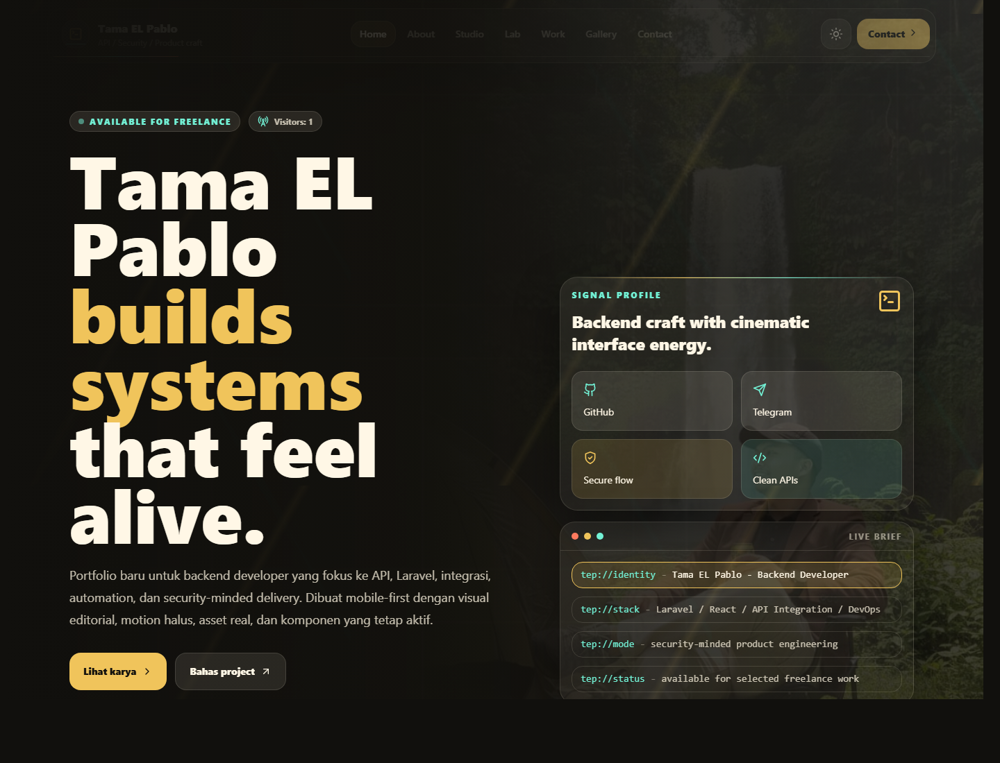
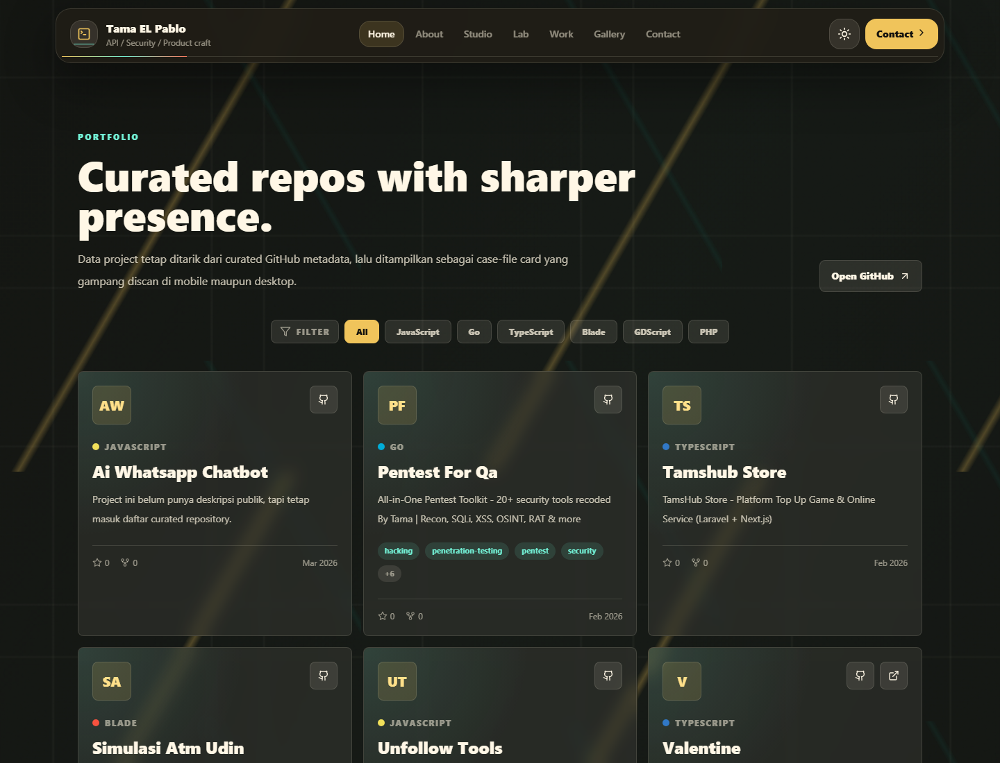
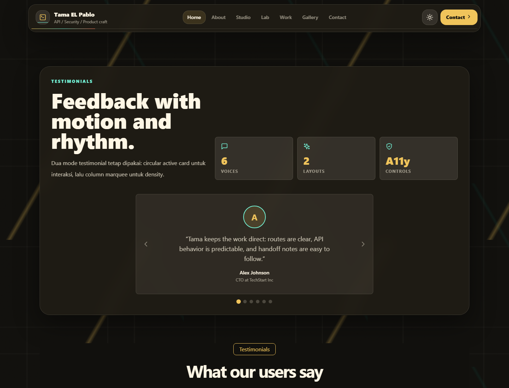
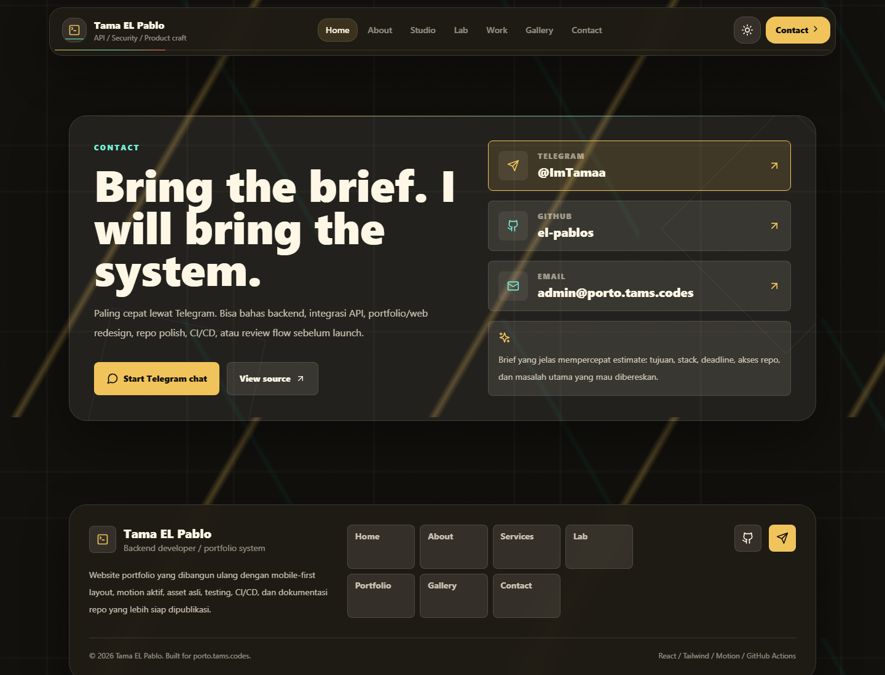
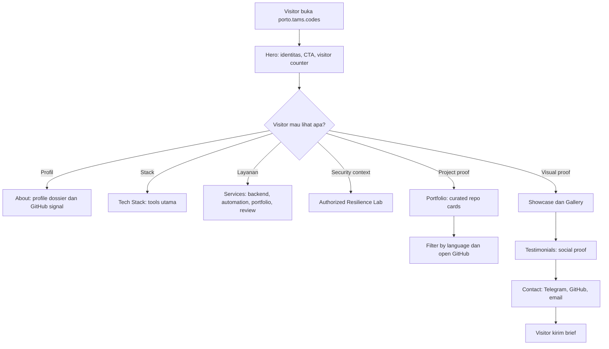
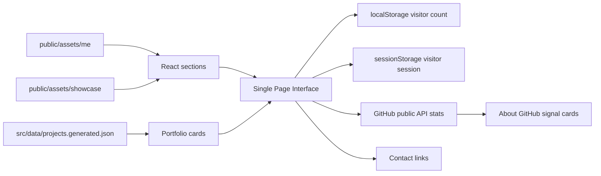

# Tama EL Pablo Portfolio


Portfolio ini adalah redesign besar untuk `porto.tams.codes`, dibangun dari source repo `el-pablos/portome` dengan arah visual baru yang lebih elegan, sinematik, aktif, dan mobile-first. Fokusnya bukan cuma bikin halaman profil yang terlihat rapi, tapi bikin pengalaman yang terasa hidup: motion halus, kartu interaktif, filter portfolio, gallery asset asli, testimonial aktif, contact flow jelas, dan dokumentasi repo yang siap dipakai buat publish maupun maintenance.

Versi ini tetap mempertahankan modul inti dari portfolio sebelumnya: hero, about, tech stack, services, authorized resilience lab, curated portfolio, evidence showcase, gallery, testimonial, contact, footer, metadata SEO, testing, CI, release flow, dan helper update metadata GitHub. Yang berubah total adalah treatment desain dan struktur pengalaman. Palet lama yang terasa generik diganti menjadi obsidian hangat dengan brass gold, mint signal, dan aksen coral yang lebih editorial. Layout juga ditata ulang supaya nyaman discan di layar kecil dulu, lalu naik ke tablet dan desktop tanpa kehilangan komposisi besar.

Dokumentasi ini sengaja jadi satu-satunya file Markdown di repo. Semua penjelasan teknis, screenshot, arsitektur, flow, testing, deployment, security note, dan contributor ditaruh di sini supaya tidak ada dokumentasi tercecer.

## Ringkasan Project

Project ini adalah portfolio React single-page app untuk Tama EL Pablo, seorang backend developer yang fokus ke Laravel, API integration, database flow, automation, deployment, dan security-minded delivery. Website dibuat untuk memperlihatkan dua sisi sekaligus: kemampuan backend yang rapi dan kemampuan membungkus pekerjaan teknis menjadi interface yang premium. Karena itu, halaman tidak dibuat seperti landing page statis biasa. Setiap section punya peran dan komponen aktif sendiri.

Hero bertugas memberi first impression yang kuat dengan foto asli sebagai latar, live visitor counter berbasis local storage, CTA utama, signal cards, dan terminal brief. About membawa profile dossier, role summary, GitHub signal, dan link kontak. Tech Stack memperlihatkan tools utama yang dipakai. Services menjelaskan layanan backend, automation, portfolio build, dan security review. Authorized Resilience Lab dipakai untuk menjelaskan capability security secara aman: bahasannya diarahkan ke audit, validation, report, dan hardening, bukan promosi aktivitas destruktif. Portfolio menampilkan curated GitHub repository card dengan filter bahasa. Showcase menampilkan evidence wall dari screenshot lama atau asset proof yang aman. Gallery menjaga personality dengan asset visual asli. Testimonials menampilkan dua pola UI: active carousel dan dense column feedback. Contact menyelesaikan flow dengan link Telegram, GitHub, email, dan footer navigation.

Target redesign ini jelas: website harus kelihatan beda, elegan, punya motion, tetap cepat, dan tidak mengorbankan aksesibilitas. Motion dibuat dengan `framer-motion`, tapi tetap menghormati preferensi `prefers-reduced-motion`. Layout memakai Tailwind utility yang mobile-first. Komponen visual memakai ikon dari `lucide-react` agar konsisten dan tidak bergantung ke SVG custom yang sulit dirawat.

## Preview Visual

Screenshot dibuat dari build production menggunakan helper `scripts/capture-screenshots.mjs`. Helper ini memakai Chrome DevTools Protocol lewat Microsoft Edge lokal, jadi screenshot diambil dari DOM build nyata, bukan mockup manual. Untuk environment ini, server HTTP lokal tidak bisa dibuka karena WinSock provider error, jadi capture memakai file build dengan patch path sementara di folder `build` yang tidak ikut commit.

### Home Desktop



### Home Mobile



### About



### Tech Stack



### Services



### Authorized Resilience Lab


### Portfolio



### Gallery


### Testimonials



### Contact



## Arsitektur Project

Project ini memakai React 18 dengan Create React App sebagai build layer, Tailwind CSS untuk styling utility, Framer Motion untuk animasi, Jest dan React Testing Library untuk unit/smoke test, serta GitHub Actions untuk CI dan release automation. Karena ini portfolio statis, tidak ada database runtime. Data yang tampil berasal dari file lokal, metadata repo, asset publik, state browser ringan, dan request publik GitHub API untuk signal di halaman About.

Struktur utamanya dibuat seperti ini:

```text
src/
  App.js
  index.js
  index.css
  components/
    sections/
      Hero.jsx
      About.jsx
      TechStack.jsx
      Services.jsx
      StressingService.jsx
      Portfolio.jsx
      Showcase.jsx
      Gallery.jsx
      Testimonials.jsx
      Contact.jsx
      Footer.jsx
    common/
      Button.jsx
      Card.jsx
      LazyImage.jsx
      SectionTitle.jsx
    ui/
      tubelight-navbar.jsx
      circular-testimonials.jsx
      zoom-parallax.jsx
      ...
  data/
    projects.generated.json
  hooks/
    useReducedMotion.js
    usePageVisibility.js
  __tests__/
    App.test.js
    Sections.test.js
    UIComponents.test.js
  __mocks__/
    @number-flow/
    @tsparticles/
public/
  assets/
    me/
    showcase/
    screenshots/
scripts/
  capture-screenshots.mjs
  github-repo-metadata.ps1
  sync-projects.mjs
.github/
  workflows/
    ci.yml
    release.yml
    deploy.yml
```

`App.js` menjadi shell utama: global theme, CSS variables, navigation, active section detection, animated title, favicon animation, lazy section loading, dan fallback loader. Section utama dipisah agar setiap area punya ownership yang jelas. `Hero.jsx` fokus ke first impression dan CTA. `About.jsx` menangani profile, GitHub signal, dan role summary. `Portfolio.jsx` membaca curated repository data dari `projects.generated.json`. `Showcase.jsx` dan `Gallery.jsx` memakai asset lokal di `public/assets` supaya visual tidak bergantung ke hotlink luar. `Testimonials.jsx` membawa carousel dan column feedback. `Contact.jsx` menyatukan action links dan handoff.

Desain theme tidak dibuat sebagai satu hue monoton. Warna utama gelap hangat, aksen brass, mint, dan coral dipakai untuk hierarchy. CSS variable tetap menyimpan alias `--violet-*` sebagai compatibility layer untuk komponen lama yang belum perlu dibuang total, tapi visual final tidak lagi terasa seperti palette ungu generik.

## Flowchart Pengalaman


```mermaid
flowchart TD
    A[Visitor buka porto.tams.codes] --> B[Hero: identitas, CTA, visitor counter]
    B --> C{Visitor mau lihat apa?}
    C -->|Profil| D[About: profile dossier dan GitHub signal]
    C -->|Stack| E[Tech Stack: tools utama]
    C -->|Layanan| F[Services: backend, automation, portfolio, review]
    C -->|Security context| G[Authorized Resilience Lab]
    C -->|Project proof| H[Portfolio: curated repo cards]
    H --> I[Filter by language dan open GitHub]
    C -->|Visual proof| J[Showcase dan Gallery]
    J --> K[Testimonials: social proof]
    K --> L[Contact: Telegram, GitHub, email]
    L --> M[Visitor kirim brief]
```

## Data Flow

Karena tidak ada database runtime, ERD tradisional tidak relevan. Flow data yang benar untuk project ini adalah alur asset, local data, browser state, dan GitHub public API.


```mermaid
flowchart LR
    A[public/assets/me] --> D[React sections]
    B[public/assets/showcase] --> D
    C[src/data/projects.generated.json] --> P[Portfolio cards]
    D --> UI[Single Page Interface]
    P --> UI
    UI --> S[localStorage visitor count]
    UI --> T[sessionStorage visitor session]
    UI --> G[GitHub public API stats]
    G --> A2[About GitHub signal cards]
    UI --> C2[Contact links]
```

`localStorage` hanya dipakai untuk visitor count dan cache GitHub stats ringan. `sessionStorage` dipakai supaya satu sesi browser tidak menaikkan counter berkali-kali. Tidak ada secret, token, credential, atau private endpoint yang dipanggil dari frontend.

## Mobile-First Design

Mobile-first bukan cuma menambahkan breakpoint kecil di akhir. Layout dasar dibuat untuk layar kecil dulu: hero copy dibatasi agar tidak melebar, CTA menjadi full-width, cards stack secara vertikal, bottom nav memakai icon-first, dan text size tidak diskalakan memakai viewport width. Setelah itu baru naik ke `sm`, `md`, `lg`, dan `xl` untuk grid, desktop navigation, dan layout dua kolom.

Ada beberapa detail penting di versi ini:

1. Hero mobile punya max-width eksplisit agar renderer mobile, screenshot headless, dan perangkat kecil tidak memotong teks.
2. CTA mobile memakai full-width supaya jari gampang menekan target utama.
3. Bottom nav memakai ikon untuk layar kecil dan menyembunyikan label panjang sampai ruangnya cukup.
4. Section cards memakai radius maksimal yang masih terasa modern tapi tidak seperti bubble UI berlebihan.
5. Text besar hanya dipakai untuk hero atau section headline, bukan untuk panel kecil.
6. Motion tetap aktif, tapi tidak mengunci konten jika user memakai reduced motion.
7. Image memakai asset asli dan `object-cover` dengan overlay, jadi desain tetap punya identitas nyata.

## Motion dan Komponen Aktif

Motion dipakai untuk memberi rasa premium, bukan sekadar dekorasi. Hero punya reveal sequence, CTA shine sweep, terminal brief yang berganti line, visitor counter, hover lift pada kartu, active navigation indicator, carousel testimonial, dan gallery treatment. Di desktop, nav atas memakai progress line dan active state. Di mobile, tubelight nav memberi affordance aktif tanpa memakan banyak ruang.

Komponen yang aktif tetap punya fallback. Jika user mengaktifkan reduced motion, section tidak menunggu animasi masuk, title/fav icon animation berhenti, dan konten tetap langsung terbaca. Ini penting karena portfolio harus terasa keren, tapi tetap usable.

## Security dan Secret Handling

Repo ini tidak menyimpan token atau credential. Script `scripts/github-repo-metadata.ps1` membaca token dari environment variable `GITHUB_TOKEN` atau `GH_TOKEN`, lalu memakai GitHub API untuk update metadata repo. Token tidak ditulis ke file, tidak masuk README, tidak masuk workflow, dan tidak masuk commit.

`.gitignore` juga dikunci untuk file sensitif umum:

```text
.env
.env.*
*.key
*.pem
*.p12
*.token
```

Selain itu, dokumentasi Markdown dibuat tunggal: hanya `README.md` yang menjadi file dokumentasi repo. Ini membantu menjaga repo tetap bersih dan menghindari catatan internal tercecer.

## CI/CD dan Release Flow

Repo sudah punya tiga workflow utama:

1. `ci.yml`: berjalan di push dan pull request untuk branch `main` dan `second`. Workflow ini install dependency, lint, test CI dengan coverage, build production, lalu upload artifact coverage dan build.
2. `release.yml`: berjalan di push ke `main` dan `second`. Workflow ini lint, test, build, package output build menjadi zip, membuat tag otomatis berbasis versi package, branch, run number, dan short SHA, lalu membuat GitHub Release terbaru.
3. `deploy.yml`: workflow manual untuk build artifact dan optional SCP deploy kalau secret server tersedia di repository settings.

Strategi tagging dibuat agar setiap push penting punya versi rilis yang traceable. Versi package saat ini `0.2.0`, dan release workflow bisa menghasilkan tag seperti `v0.2.0.<run>-second-<sha>`. Jadi branch redesign tetap bisa punya histori release sendiri tanpa harus menunggu merge ke branch lain.

## Cara Install

Butuh Node.js minimal versi 20.

```bash
npm install
npm start
```

Untuk build production:

```bash
npm run build
```

Untuk lint:

```bash
npm run lint
```

Untuk test CI lengkap dengan coverage:

```bash
npm run test:ci
```

Untuk capture screenshot setelah build:

```bash
npm run build
node scripts/capture-screenshots.mjs
```

Helper screenshot default memakai Microsoft Edge di path Windows standar. Kalau Edge ada di lokasi lain, set `EDGE_PATH`:

```bash
EDGE_PATH="C:\\Path\\To\\msedge.exe" node scripts/capture-screenshots.mjs
```

## Testing Evidence

Verifikasi lokal terakhir:

```text
npm run lint      -> passed
npm run test:ci   -> 3 suites passed, 25 tests passed, 0 failed
npm run build     -> compiled successfully
```

Coverage bukan 100 persen line coverage, karena masih ada beberapa UI utility lama yang tidak semuanya dipakai sebagai production path. Yang wajib untuk rollout ini adalah 100 persen test result passed, dan itu terpenuhi: 25 test pass tanpa failing suite. Test yang ada mencakup app shell, major sections, UI components, mocks untuk dependency animasi, dan rendering section penting seperti resilience lab serta showcase.

Saat test berjalan, ada warning dependency dari ekosistem CRA/Browserslist seperti `baseline-browser-mapping`, `caniuse-lite`, dan `punycode`. Warning ini tidak membuat test gagal dan tidak berasal dari kode portfolio. Build production tetap sukses.

## Repository Metadata

Metadata yang disiapkan untuk repo:

```text
Description:
Portfolio sinematik Tama EL Pablo dengan React, Tailwind, motion, gallery asset asli, dan CI/CD release flow.

Homepage:
https://porto.tams.codes

Topics:
portfolio, react, tailwindcss, framer-motion, developer-portfolio, mobile-first, github-actions, ci-cd, tama-el-pablo, porto-tams-codes
```

Script update metadata:

```powershell
$env:GITHUB_TOKEN = "<token sementara dari environment>"
.\scripts\github-repo-metadata.ps1
```

Jangan taruh token ke file. Jalankan script hanya dengan environment variable sementara, lalu clear environment kalau sudah selesai.

## Statistik Repo


Badge di atas akan hidup setelah branch dan workflow tersedia di GitHub. Kalau branch `second` belum dipush, badge branch mungkin belum menampilkan status terbaru.

## Kontributor

Project ini dibuat dan dimiliki oleh:

```text
Tama EL Pablo
GitHub: @el-pablos
Website: https://porto.tams.codes
```

## Catatan Maintenance

Untuk update konten portfolio, mulai dari `src/data/projects.generated.json` jika yang berubah adalah daftar project. Untuk update profil dan copywriting utama, edit section di `src/components/sections`. Untuk update asset visual, simpan file di `public/assets/me` atau `public/assets/showcase`, lalu pastikan path yang dipakai komponen tetap relative ke public root.

Setelah edit apa pun, jalankan urutan ini:

```bash
npm run lint
npm run test:ci
npm run build
node scripts/capture-screenshots.mjs
```

Kalau semua passed dan screenshot terlihat benar, baru commit. Flow ini menjaga repo tetap publish-ready, screenshot README tetap aktual, dan CI tidak menangkap error yang sebenarnya bisa dicek lokal dulu.

## Keputusan Desain

Beberapa keputusan desain sengaja dibuat konservatif walaupun tampilannya tetap wah. Pertama, website tidak memakai background orb, blob, atau gradient dekoratif yang terlalu generik. Visual utama dibangun dari foto asli, grid editorial, garis diagonal, kartu glass yang tipis, dan aksen warna yang punya fungsi jelas. Kedua, teks besar dipakai untuk headline section saja. Kartu, tombol, nav, dan panel kecil tetap memakai ukuran yang lebih rapat supaya interface terasa premium, bukan sekadar besar. Ketiga, komponen portfolio dan showcase dibuat dense tapi masih bisa discan, karena target pembacanya kemungkinan ingin cepat menilai skill, repo, bukti kerja, dan cara kontak.

Keempat, lab security ditulis sebagai authorized resilience flow. Ini menjaga positioning tetap profesional dan aman: yang ditonjolkan adalah audit, validation, documentation, dan hardening. Kelima, screenshot README diambil setelah build production, bukan dari dev mode, supaya dokumentasi mencerminkan output yang akan dikirim ke hosting. Keenam, branch `second` dipakai sebagai tempat redesign penuh agar perubahan besar bisa direview tanpa mengganggu histori utama. Semua keputusan ini mendukung tujuan utama: portfolio terlihat beda, elegan, aktif, dan tetap bisa dipelihara dengan workflow engineering yang masuk akal.

## Status

Branch aktif untuk redesign ini adalah `second`. Desain, CI/CD, screenshot, metadata helper, testing, dan README sudah disiapkan untuk publish flow. Website tetap React SPA, ringan, mobile-first, dan memakai asset asli agar portfolio terasa personal sekaligus profesional.
