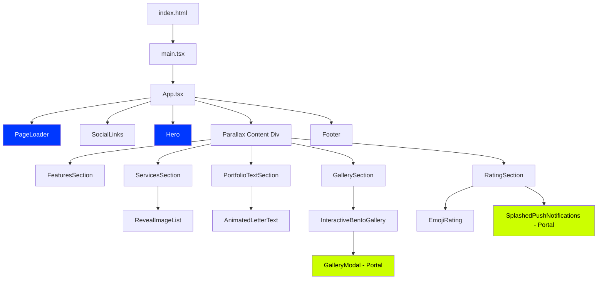
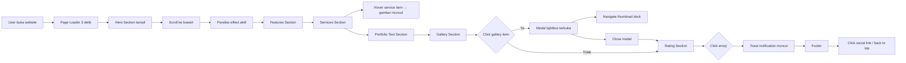

# 🚀 Sugi.dev — Portfolio Frontend Developer


Portfolio website modern buat frontend developer yang dibangun pake React + Vite + TypeScript + Tailwind CSS v4 + Framer Motion. Design-nya bold, animasinya smooth, dan performanya kenceng.

---

## 📋 Daftar Isi

- [Deskripsi Projek](#-deskripsi-projek)
- [Tech Stack](#-tech-stack)
- [Arsitektur Projek](#-arsitektur-projek)
- [Struktur File](#-struktur-file)
- [Fitur & Komponen](#-fitur--komponen)
- [Diagram Arsitektur](#-diagram-arsitektur)
- [Flowchart Interaksi User](#-flowchart-interaksi-user)
- [Instalasi & Setup](#-instalasi--setup)
- [Development](#-development)
- [Testing](#-testing)
- [Build & Deploy](#-build--deploy)
- [Kustomisasi](#-kustomisasi)
- [Design System](#-design-system)
- [Catatan Teknis Penting](#-catatan-teknis-penting)
- [Kontributor](#-kontributor)
- [Lisensi](#-lisensi)

---

## 🎯 Deskripsi Projek

Sugi.dev adalah portfolio website buat frontend developer yang fokus ke visual impact dan user experience. Website ini didesain dengan pendekatan "bold typography + smooth animation" yang bikin kesan pertama langsung kuat.

**Highlight utama:**
- Page loader animasi 3 detik dengan progress ring dan spinning diamond
- Hero section fullscreen biru dengan floating cards dan text shadow 8 layer
- Parallax scrolling effect antara hero dan konten
- Interactive bento gallery dengan modal lightbox
- Emoji rating system dengan toast notifications
- Social links sidebar yang slide-in dari kiri
- Responsive design dari mobile 375px sampe desktop 1440px+
- Semua animasi respect `prefers-reduced-motion`

---

## 🛠 Tech Stack

| Teknologi | Versi | Fungsi |
|-----------|-------|--------|
| React | 18.3 | UI Library |
| Vite | 6.0 | Build tool & dev server |
| TypeScript | 5.9 | Type safety |
| Tailwind CSS | 4.1 | Utility-first CSS |
| Framer Motion | 12.x | Animasi & gesture |
| Vitest | 2.1 | Unit testing |
| Testing Library | 16.x | Component testing |
| class-variance-authority | 0.7 | Variant styling |
| clsx + tailwind-merge | - | Class merging utility |
| react-icons | 5.5 | Icon library |
| lucide-react | 0.468 | Additional icons |

---

## 🏗 Arsitektur Projek

Projek ini pake arsitektur **Single Page Application (SPA)** dengan component-based architecture. Semua section dirender dalam satu halaman dengan scroll-based navigation.

### Layer Architecture

```
┌─────────────────────────────────────────────┐
│                  App.tsx                      │
│  (Layout orchestrator + parallax transform)  │
├─────────────────────────────────────────────┤
│  PageLoader │ SocialLinks │ Hero │ Footer    │
│  (Fixed/Portal layers - z-index managed)     │
├─────────────────────────────────────────────┤
│  Content Sections (inside parallax div)      │
│  Features → Services → Portfolio → Gallery   │
│  → Rating                                    │
├─────────────────────────────────────────────┤
│  Shared Utilities                            │
│  cn() │ AnimatedLetterText │ EmojiRating     │
│  Toast Notifications (Portal)                │
└─────────────────────────────────────────────┘
```

### Z-Index Strategy

| Layer | Z-Index | Komponen |
|-------|---------|----------|
| Page Loader | 99999 | Fullscreen overlay saat loading |
| Toast Notifications | 99998 | Push notifications (portal) |
| Gallery Modal | 9999 | Lightbox modal (portal) |
| Mobile Social Toggle | 50 | FAB button mobile |
| Desktop Social Links | 40 | Fixed sidebar kiri |
| Navbar | 30 | Navigation bar |
| Content | 20 | Main parallax content |
| Hero Cards | 10 | Floating cards di hero |

---

## 📁 Struktur File

```
src/
├── components/
│   └── ui/
│       ├── page-loader.tsx              # Loader fullscreen 3 detik
│       ├── hero.tsx                     # Hero section biru + navbar
│       ├── features-section.tsx         # 3 feature cards grid
│       ├── services-section.tsx         # Services + tech stack
│       ├── reveal-images.tsx            # Hover reveal image list
│       ├── portfolio-text-section.tsx   # PORTFOLIO text raksasa
│       ├── potfolio-text.tsx            # AnimatedLetterText component
│       ├── gallery-section.tsx          # Gallery wrapper
│       ├── interactive-bento-gallery.tsx # Bento grid + modal
│       ├── rating-section.tsx           # Rating section wrapper
│       ├── emoji-rating.tsx             # 5 emoji rating buttons
│       ├── splashed-push-notifications.tsx # Toast notification system
│       ├── social-links.tsx             # Fixed social sidebar
│       └── footer-section.tsx           # Footer dengan links
├── lib/
│   └── utils.ts                         # cn() utility function
├── test/
│   ├── setup.ts                         # Test environment setup
│   ├── components/                      # Component tests
│   │   ├── app.test.tsx
│   │   ├── page-loader.test.tsx
│   │   ├── hero.test.tsx
│   │   ├── features-section.test.tsx
│   │   ├── services-section.test.tsx
│   │   ├── portfolio-text-section.test.tsx
│   │   ├── gallery-section.test.tsx
│   │   ├── emoji-rating.test.tsx
│   │   ├── rating-section.test.tsx
│   │   ├── social-links.test.tsx
│   │   └── footer-section.test.tsx
│   └── lib/
│       └── utils.test.ts
├── App.tsx                              # Root component
├── main.tsx                             # Entry point
├── index.css                            # Global styles + CSS vars
└── vite-env.d.ts                        # Vite type declarations
```

---

## ✨ Fitur & Komponen

### 1. Page Loader
Loader fullscreen yang muncul 3 detik sebelum konten tampil. Ada progress ring SVG, orbiting dot, spinning diamond, dan counter persen. Scroll dikunci selama loading.

### 2. Hero Section
Layar penuh warna biru (`#0038FF`) dengan:
- Grid background 60x60px
- Navbar responsive dengan logo pill dan nav links
- Teks hero 3 baris (SUGI / FRONTEND / DEV) dengan 8-layer text shadow
- Floating cards animasi di desktop
- Pill cards di mobile
- Availability badge dengan pulsing dot

### 3. Features Section
Tiga card dalam grid 3 kolom:
- **BUILD FAST UIs** — pill interaktif dengan ripple effect
- **CLEAN CODEBASE** — badge shadcn/ui + arrow button
- **SHIP ON TIME** — counter 42+ projects

### 4. Services Section
Grid 2 kolom dengan:
- Reveal image list (hover untuk lihat gambar)
- Tech stack pills dengan stagger animation
- Experience card yang bisa di-hover
- Availability badge

### 5. Portfolio Text Section
Teks "PORTFOLIO" raksasa dengan huruf O diganti SVG diamond berputar. Animasi slide-in dari kiri.

### 6. Gallery Section
Bento grid gallery dengan 7 media items (4 gambar + 3 video). Click untuk buka modal lightbox dengan thumbnail dock navigasi.

### 7. Rating Section
Emoji rating (😔😕😐🙂😍) dengan:
- Glow ring effect saat active
- Burst ring animation on click
- Label text dengan blur transition
- Toast notification berbeda per rating

### 8. Social Links
- Desktop: fixed sidebar kiri yang slide-in on hover
- Mobile: FAB button dengan expandable menu

### 9. Footer
Footer dengan logo, description, social icons, navigation links, dan contact links. Semua dengan entrance animation.

---

## 📊 Diagram Arsitektur


```mermaid
graph TD
    A[index.html] --> B[main.tsx]
    B --> C[App.tsx]
    C --> D[PageLoader]
    C --> E[SocialLinks]
    C --> F[Hero]
    C --> G[Parallax Content Div]
    G --> H[FeaturesSection]
    G --> I[ServicesSection]
    I --> J[RevealImageList]
    G --> K[PortfolioTextSection]
    K --> L[AnimatedLetterText]
    G --> M[GallerySection]
    M --> N[InteractiveBentoGallery]
    N --> O[GalleryModal - Portal]
    G --> P[RatingSection]
    P --> Q[EmojiRating]
    P --> R[SplashedPushNotifications - Portal]
    C --> S[Footer]

    style D fill:#0038FF,color:#fff
    style F fill:#0038FF,color:#fff
    style O fill:#CCFF00,color:#000
    style R fill:#CCFF00,color:#000
```

---

## 🔄 Flowchart Interaksi User


```mermaid
flowchart LR
    A[User buka website] --> B[Page Loader 3 detik]
    B --> C[Hero Section tampil]
    C --> D[Scroll ke bawah]
    D --> E[Parallax effect aktif]
    E --> F[Features Section]
    F --> G[Services Section]
    G --> H[Hover service item → gambar muncul]
    G --> I[Portfolio Text Section]
    I --> J[Gallery Section]
    J --> K{Click gallery item}
    K -->|Ya| L[Modal lightbox terbuka]
    L --> M[Navigate thumbnail dock]
    L --> N[Close modal]
    K -->|Tidak| O[Rating Section]
    N --> O
    O --> P{Click emoji}
    P --> Q[Toast notification muncul]
    Q --> R[Footer]
    R --> S[Click social link / back to top]
```

---

## 🚀 Instalasi & Setup

### Prerequisites
- Node.js >= 20
- npm >= 9

### Quick Start

```bash
# Clone repo
git clone https://github.com/el-pablos/portome.git
cd portome

# Checkout branch
git checkout third

# Install dependencies
npm install

# Jalanin dev server
npm run dev
```

Dev server jalan di `http://localhost:5173`

---

## 💻 Development

```bash
# Dev server dengan hot reload
npm run dev

# TypeScript type check
npx tsc -b --noEmit

# Build production
npm run build

# Preview production build
npm run preview
```

---

## 🧪 Testing

Projek ini pake **Vitest** + **Testing Library** buat unit testing.

```bash
# Jalanin semua test
npm test

# Jalanin test sekali (CI mode)
npx vitest run

# Test dengan coverage
npm run test:ci
```

### Test Coverage

| File | Tests | Status |
|------|-------|--------|
| App.tsx | 3 | ✅ Passed |
| page-loader.tsx | 5 | ✅ Passed |
| hero.tsx | 6 | ✅ Passed |
| features-section.tsx | 4 | ✅ Passed |
| services-section.tsx | 5 | ✅ Passed |
| portfolio-text-section.tsx | 3 | ✅ Passed |
| gallery-section.tsx | 4 | ✅ Passed |
| emoji-rating.tsx | 5 | ✅ Passed |
| rating-section.tsx | 3 | ✅ Passed |
| social-links.tsx | 3 | ✅ Passed |
| footer-section.tsx | 6 | ✅ Passed |
| utils.ts | 5 | ✅ Passed |
| **Total** | **52** | **✅ 100% Passed** |

---

## 📦 Build & Deploy

```bash
# Build production
npm run build

# Output di folder dist/
# Deploy dist/ ke hosting manapun (Vercel, Netlify, dll)
```

### Build Output
- `dist/index.html` — ~0.75 KB
- `dist/assets/index-*.css` — ~34 KB (gzip: ~7 KB)
- `dist/assets/index-*.js` — ~328 KB (gzip: ~104 KB)

---

## 🎨 Kustomisasi

### Ganti Warna Tema

Edit CSS variables di `src/index.css`:

```css
:root {
  --clr-primary:      #0038FF;   /* Warna utama (biru) */
  --clr-primary-dark: #001A99;   /* Warna shadow */
  --clr-accent:       #CCFF00;   /* Warna aksen (hijau neon) */
  --clr-bg:           #ffffff;   /* Background */
  --clr-bg-card:      #f8f9fa;   /* Background card */
  --clr-text:         #0a0a0a;   /* Teks utama */
  --clr-text-muted:   rgba(0, 0, 0, 0.5); /* Teks secondary */
}
```

### Ganti Data Personal

1. **Social links** — Edit `src/components/ui/social-links.tsx` dan `footer-section.tsx`
2. **Email** — Ganti `sugi@sugi.dev` di hero navbar
3. **Gallery items** — Edit `src/components/ui/gallery-section.tsx`
4. **Project count** — Edit angka di `features-section.tsx` dan `hero.tsx`

---

## 🎨 Design System

### Color Palette

| Token | Hex | Penggunaan |
|-------|-----|------------|
| Primary | `#0038FF` | Background hero, buttons, links |
| Primary Dark | `#001A99` | Text shadows |
| Accent | `#CCFF00` | Badges, highlights, CTAs |
| Background | `#FFFFFF` | Page background |
| Card BG | `#F8F9FA` | Card backgrounds |
| Text | `#0A0A0A` | Body text |
| Text Muted | `rgba(0,0,0,0.5)` | Secondary text |

### Typography

- **Font Family:** Inter (Google Fonts)
- **Display Font:** Arial Black / Impact (hero text)
- **Weights:** 300–900
- **Hero sizes:** `clamp(4.5rem, 12vw, 160px)` sampai `clamp(4.5rem, 15vw, 220px)`

### Animation Principles

- **Ease curve:** `[0.22, 1, 0.36, 1]` (custom ease-out)
- **Duration:** 0.3s–1s tergantung kompleksitas
- **Stagger:** 0.07s–0.1s antar item
- **Spring:** stiffness 300–400, damping 15–20
- **Viewport trigger:** `once: false` (replay saat scroll)

---

## ⚠️ Catatan Teknis Penting

### CSS Transform & Fixed Positioning
`motion.div` parallax di App.tsx punya `style={{ y }}` yang aktifin CSS transform. Ini bikin semua `position: fixed` di dalamnya ga relatif ke viewport lagi. Solusi: pake `createPortal(content, document.body)` buat semua modal/popup.

### Tailwind CSS v4
Pake `@import "tailwindcss"` (bukan `@tailwind base/components/utilities`). Plugin via `@tailwindcss/vite`.

### Framer Motion Import
Semua import dari `motion/react` (bukan `framer-motion` langsung).

### Framer Motion TypeScript — Ease Array
Array cubic bezier dalam Variants harus pake `as const`:
```ts
ease: [0.22, 1, 0.36, 1] as const
```

### Mobile Hero Overflow
Teks FRONTEND di layar kecil (375px) pake `overflow-hidden md:overflow-visible` biar ga overflow horizontal.

### Scroll Lock di Loader
Target `document.documentElement.style.overflow` (bukan body) buat lock scroll yang konsisten cross-browser.

---

## 👥 Kontributor

<table>
  <tr>
    <td align="center">
      <a href="https://github.com/el-pablos">
        
        <br />
        <sub><b>Tama EL Pablo</b></sub>
      </a>
      <br />
      <sub>Creator & Maintainer</sub>
    </td>
  </tr>
</table>

---

## 📄 Lisensi

MIT License © 2024 Tama EL Pablo

---

<div align="center">
  <br />
  <p><strong>Built with ❤️ using React + Vite + TypeScript + Tailwind CSS v4 + Framer Motion</strong></p>
  <p>
    <a href="https://github.com/el-pablos/portome">⭐ Star this repo</a> •
    <a href="https://github.com/el-pablos/portome/issues">🐛 Report Bug</a> •
    <a href="https://github.com/el-pablos/portome/pulls">🔀 Pull Request</a>
  </p>
</div>
